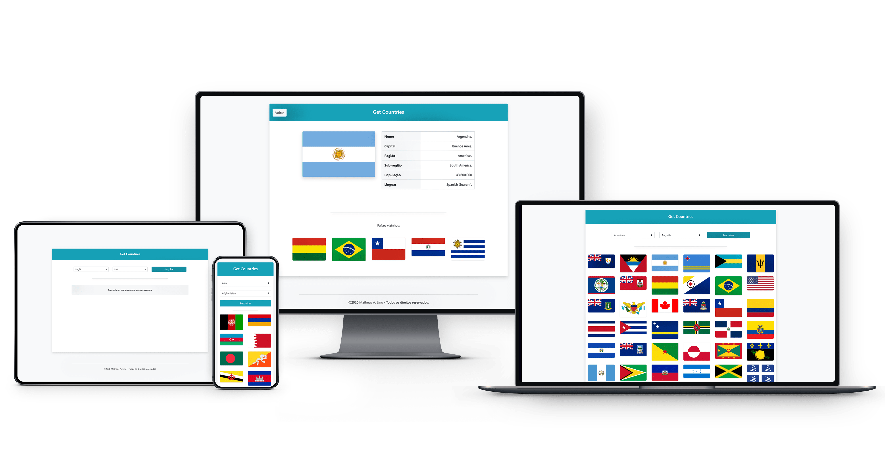

# REST COUNTRIES
>  Get information about countries via a RESTful API.

### About
Simples application applying the basic concepts about RESTful API's. The App dinamically calls the endpoints, getting all data, such as  flags, names, population and all other information from other countries.

### Developed with:
* HTML5
* CSS3
* JavaScript
* **Libraries:** JQuery
* **Frameworks:** Bootstrap
* **Resources:** Fetch API

### Screens

### Preview
* **Online:** open the following link in your browser (https://matheuslino.com.br/projects/rest-countries/) to see how it works.
* **Download:** you can download the source-code and run it on your local machine, as long as you have a network connection.

### Version
> Release: `1.0.0`

### License
MIT License